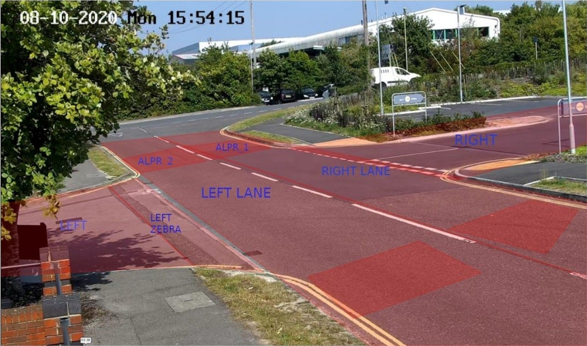

# Site Rules Specification

A site configuration consists of 6 or 7 parameters depending on the requirements which are:

1. Site Name
2. Constants
3. States
4. Zones
5. ALPR Zones
6. Alias
7. Rules

Sample site configuration rules can be found [here](#sample-configurations)

## 1. Site Name
Site name corresponds to the site where the service is deployed and is the first thing mentioned
in the configuration.

## 2. Constants:
Constants are the values which are required to be known by violation service beforehand and
refer to values such as frame rate, image height, image width etc. etc. that remain almost the
same in most of the sites.

## 3. States
States are the factors whose values vary and depending on those values, it is determined
whether an object has committed a violation or not. For example, for an object to commit a 
`running red light` violation, the value of the factor `LIGHT` has to be red.
Different values of a same factor are written in a string, seperated by pipe characters:
`Light:​ "red|yellow|green|black"`
In the above example, Light is a factor and `red`, `yellow`, `green`, and `black` are the possible
values.

## 4. Zones
Zones are the annotated regions on an image which are used to determine the passage of an
object on an intersection. The figure below shows an annotated frame with zones:



Zones are defined as multipolygons and the corners of that polygon are mentioned in the
configuration.
Following operations can be performed on zones:

* `+` - corresponds to the union of two regions
* `-` - subtracts one zone from another zone
* `*` -  gives the intersection of two zones

## 5. ALPR Zones:
ALPR zones are defined if LPR is required in some scenarios.

## 6. Alias:
Alias is a name given to a combination of zones.
`Enter:​ $Lane_1 + $Lane_2 + $Lane_3`
Each zone involved in aliasing is preceded by a `$` sign.

## 7. Rules:
The first thing in a rule is its name followed by a sequence of rulelines. Rule name cannot have
any spaces in it.

**Sample Rule with 4 rulelines:**
```yaml
RunningRedLight:
    RL1:
        Zone: $Enter
        Shot: a_shot
        States:
            vehicle_category: '!person'
            Light: 'red'
    RL2:
        Zone: $
    RL3:
        Zone: $Zebra_crossing
        Shot: b_shot
    	States:
            Light: 'red'
    RL4:
        Zone: $Exit
```        

Here, ‘RunningRedLight’ is the name of the rule. Rulelines are defined later on as `RL1`, `RL2`,
`RL3` and `RL4`. This rule defines a violation RunningRedLight in which an object commits a
violation if it passes from Enter (defined as an alias) to Zebra_Crossing while the light is red and
then passes through the Exit Zone.
RL1 defines the zone as `$Enter` and Shot as `a_shot` and finally states are mentioned. Zones can
either be given as an alias `$Enter` or they could be provided as an algebraic expression such as
`$Lane_1 + $Lane_2 + $Lane_3`. Both cases are acceptable. If a shot is required to be captured at
the end of that zone, then Shot is defined in ruleline with its name which is `a_shot` in the above
case. States in the ruleline provide the state of the environment at that instance which for `Light` is
`red` and for vehicle category is `!person`. States in rulelines support following expressions:

* `!` if a specific value of a factor has to be excluded. Like in the above example, the rule
applies to every vehicle category except a person.
* `|` which performs the **OR** operation. For instance, if it was required that even crossing the
region while the light is yellow is a violation, then State Light could be defined as Light:
‘red|yellow’.

**AND** operator is not supported because the value of states are mutually exclusive, and there
can’t be two values of a single factor at a given time. Rest of the rulelines are defined in the same
way as RL1 but RL2 is a unique ruleline, which is written when the regions between RL1 and RL3are disjoint. In that case a ruleline with Zone $ is defined, which corresponds to any region. So, if
the Enter region and Zebra regions are disjoint, we don’t care where the object goes in between
them as long as it enters the Zebra region after entering the Enter region at some point. Another
addition to the ruleline can be of the Duration parameter such as Duration: 1.5 where 1.5 is the
duration in seconds. A rule employing the parameter Duration has been provided in the above
sample configuration, named as `EnteringRightRegion`.

### Caveats

1. ALPR zones are not used in rulelines. They are just defined in the beginning of the
configuration and then violation service determines the LPR zone of the object
committing the violation.
2. Speaking of ALPR zones, LPR information would only be available if the ALPR zones are
defined before the region used in the last ruleline of a rule.
3. Composite zones are supported only as aliases or the zone subsection of rulelines.

## Sample Configurations

* **Sample SeatBelt/MobilePhone site config with `DEFAULT` sitename.**
```yaml
# site_config.yaml
# I am a commented line
DEFAULT:
    CONSTANTS:
        IMAGE_WIDTH: 1920
        IMAGE_HEIGHT: 1080
        FPS: 8 
    STATES:
        seatbelt: "violation|normal|cant_tell"
        mobile_phone: "normal|on_call|using_mobile|cant_tell"
    ZONES:
        violation_region: [[0,0],[1920,0],[1920,1080],[0,1080]]
    RULES:
        Not_Wearing_Seatbelt:
            RL1:
                Zone: $violation_region
                Shot: c_shot
                States:
                    seatbelt: 'violation'
        Using_Mobilephone:
            RL1:
                Zone: $violation_region
                Shot: c_shot
                States:
                    mobile_phone: 'on_call|using_mobile'
```

* **Sample Trajectory site config of a Site at `Riyadh`**
```yaml
RIYADH:         # Site Name
    CONSTANTS:
        IMAGE_WIDTH: 1920
        IMAGE_HEIGHT: 1080
        FPS: 7
    STATES:
        Light: "red|yellow|green|black"
        Time: "Morning|Day|Evening|Night"
        Day: "Sunday|Monday|Tuesday|Wednesday|Thursday|Friday|Saturday"
    ZONES:
        Intersection: [[857, 458], [675, 368], [159, 404], [176, 510]]
        Left: [[4, 405], [159, 404], [176, 510], [4, 526]]
        Right: [[757, 407], [873, 466], [1071, 437], [971, 390]]
        Straight: [[263, 336], [516, 314], [582, 404], [244, 432]]
        RT_Lane: [[1328, 515], [1503, 498], [1901, 597], [1727, 658]]
        LT_Lane: [[216, 508], [393, 496], [1097, 1078], [464, 1078]]
        Lane_3: [[393, 496], [533, 484], [1860, 1078], [1097, 1078]]
        Lane_2: [[533, 484], [677, 473], [1917, 906], [1860, 1078]]
        Lane_1: [[677, 473], [820, 461], [1918, 755], [1917, 906]]
        Zebra: [[216, 508], [820, 461], [947, 507], [242, 568]]
    ALIAS:
        Enter: $Lane_1 + $Lane_2 + $Lane_3 + $LT_Lane + $RT_Lane
        Exit: $Left + $Right + $Straight
    RULES:
        # Event when an object runs a red light
        # This event has 3 shots. The object path follows the following pattern:
        # 1- Object is behind intersection while the light is red and then goes to
        # 2- Zebra region and then to
        # 3- Intersection and stays there for 1 second (with early capture) and then
            # Also, Since regions are disjoint empty ruleLines RL3 and RL6 are used
        Failure_to_Stop_at_RL:
            RL1: 
                Zone: $Enter - $Zebra
                Shot: a_shot
                States:
                    Light: 'red'
            RL2:
                Zone: $Zebra
                Shot: b_shot
                States:
                    Light: 'red'
            RL3:
                Zone: $
            RL4:
                Zone: $Intersection
                Duration: 1
                Shot: c_shot
                States:
                    Light: 'red'
            RL5:
                Zone: $Intersection
            RL6:
                Zone: $ 
            RL7:
                Zone: $Exit
        # Event when an object takes a left turn from straight only lane
        # This event has 3 shots. The object path follows the following pattern:
        # 1- Object is behind intersection then goes to
        # 2- then to intersection of zebra with (Enter - Left) to 
        # 3- Intersection to
        # 4- Left region
        Left_Turn_from_Wrong_Lane:
            RL1:
                Zone: ($Enter - $LT_Lane) - $Zebra
                Shot: a_shot
            RL2:
                Zone: ($Enter - $LT_Lane) * $Zebra
                Shot: b_shot
            RL3:
                Zone: $
            RL4:
                Zone: $Intersection
                Shot: c_shot
            RL5:
                Zone: $Left
        # Event when an object goes straight from a turn only lane
        # This event has 3 shots. The object path follows the following pattern:
        # 1- Object is behind intersection then goes to
        # 2- then to intersection of zebra with Left Lane to 
        # 3- Intersection to
        # 4- Straight region
        Straight_from_Turn_Only_Lane:
            RL1:
                Zone: $LT_Lane - ($LT_Lane * $Zebra)
                Shot: a_shot
            RL2:
                Zone: $LT_Lane * $Zebra
                Shot: b_shot
            RL3:
                Zone: $
            RL4:
                Zone: $Intersection
            RL5:
                Zone: $Straight
                Shot: c_shot
        # Event when an object goes right from the wrong lane
        # This event has 3 shots. The object path follows the following pattern:
        # 1- Object is behind intersection then goes to
        # 2- then to intersection of zebra with intersection of Enter and Left Lane to 
        # 3- Intersection to
        # 4- Right region
        Right_Turn_from_Wrong_Lane:
            RL1:
                Zone: ($Enter - $RT_Lane) - $Zebra
                Shot: a_shot
            RL2:
                Zone: ($Enter * $RT_Lane) * $Zebra
                Shot: b_shot
            RL3:
                Zone: $
            RL4:
                Zone: $Intersection
            RL5:
                Zone: $Right
                Shot: c_shot
        # Event when an object blocks the pedestrain crossing
        # This event has 3 shots. The object path follows the following pattern:
        # 1- Object is behind intersection then goes to
        # 2- zebra and stays there for 3 seconds
        Block_Pedestrian_Crossing:
            RL1:
                Zone: $Enter - $RT_Lane - $Zebra
                Shot: a_shot
            RL2:
                Zone: $Zebra
                Duration: 3
                Shot: c_shot
                States:
                    Light: 'red'
        # Event when an object goes into a restricted lane
        # This event has 3 shots. The object path follows the following pattern:
        # 1- Object is in a non-restricted zone
        # 2- Object goes to restricted zone and stays there for 1 second
        Driving_in_Restricted_Lane:
            RL1:
                Zone: $Enter - $LT_Lane
                Shot: a_shot
            RL2:
                Zone: $LT_Lane
                Duration: 1
                Shot: b_shot
```

* **Sample SB/MP site config for `AI_ACTIVE`**
```yaml
AI_ACTIVE:
    CONSTANTS:
        IMAGE_WIDTH: 1920
        IMAGE_HEIGHT: 1080
        FPS: 8 
    STATES:
        Seatbelt: "violation|normal|cant_tell"
        mobile_phone: "normal|on_call|using_mobile|cant_tell"
    ZONES:
        violation_region: [[1,161],[1530,92],[1917,374],[1916,804],[0,943], [1,161]]
    RULES:
        # Event when a driver is not wearing seatbelt
        # This event has just 1 shot. A violation region is defined and when an object
        # passes throught that region not wearing seatbelt, this event is triggered
        Not_Wearing_Seatbelt:
            RL1:
                Zone: $violation_region
                Shot: c_shot
                States:
                    Seatbelt: 'violation'
        # Event when a driver is using mobile phone
        # This event has just 1 shot. A violation region is defined and when an object
        # passes throught that region using mobile phone, this event is triggered
        Using_Mobilephone:
            RL1:
                Zone: $violation_region
                Shot: c_shot
                States:
                    mobile_phone: 'using_mobile'
        # Event when a driver is on call
        # This event has just 1 shot. A violation region is defined and when an object
        # passes throught that region using mobile phone, this event is triggered
        On_Call:
            RL1:
                Zone: $violation_region
                Shot: c_shot
                States:
                    mobile_phone: 'on_call
```
